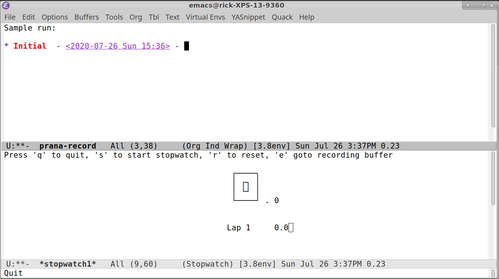
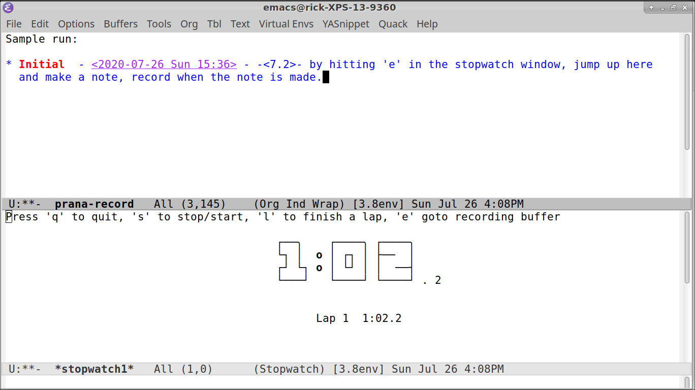
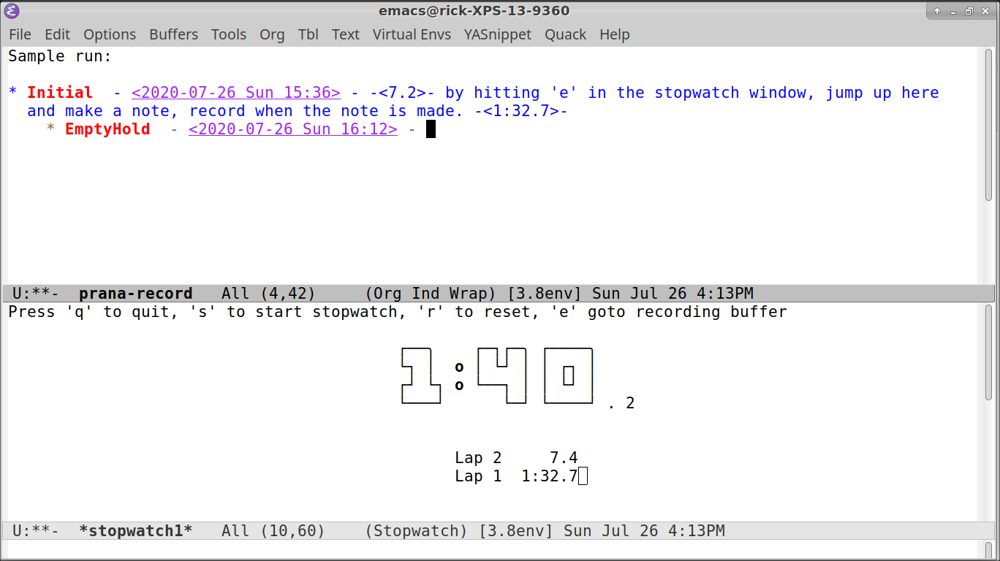
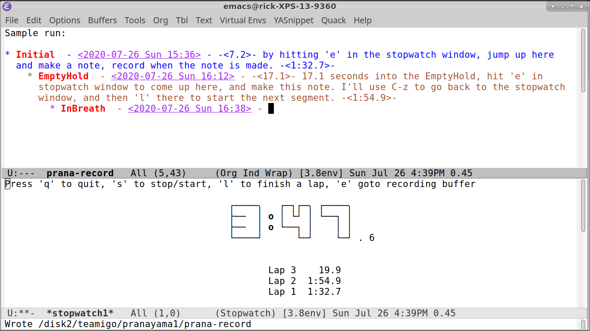
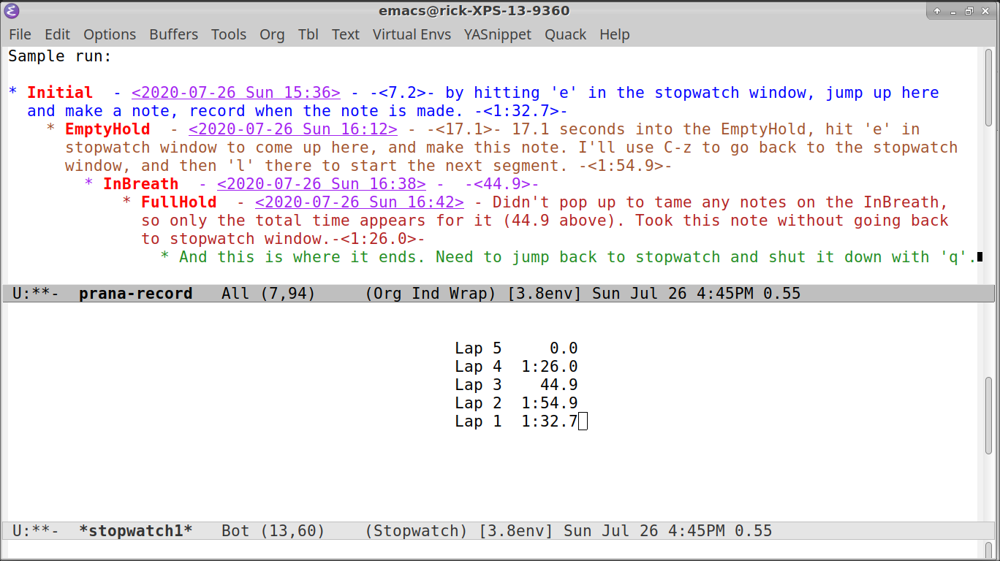

# Pranayama Readme
## Overview
**I have been doing breath work (*pranayama*), doing very deep breathing consisting of 4 distinct segments:  
1. packing the prana in, for the intial period,   
2. holding on a complete exhale for the second period,   
3. breathing in for the third period,   
4. and holding after a complete inhale.   **

I'm using the (stopwatch code created by ASNR) [https://github.com/asnr/stopwatch] . 

## To use
   In the emacs buffer where the process will be recorded. M-x prana-start. This will create a split window with a stopwatch in the bottom panel. 

C-z will jump the active cursor to the stopwatcn window, in there 's' will start it going. Then 'e' will jump back to the recording window to make a note, C-z will take you back to the stopwatch.

'l' in the stopwatch window starts a new segment, EmptyHold in this case. Hitting 'l' will create a new heading in the recording window up to the 4th segment, the end of a round.

This next screenshot shows taking a note and starting the 3rd segment *InBreath* 

Now we've done all the segments. *fini*.

## Requirements  
1. Emacs (using 26.1), org-mode, stopwatch, and pymacs (all on Melpa)  
2. Python 3 (using 3.8), modules - csv, matplotlib, and tkinter  
